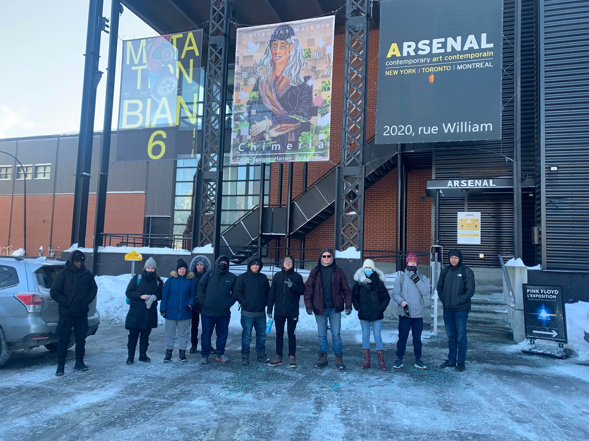
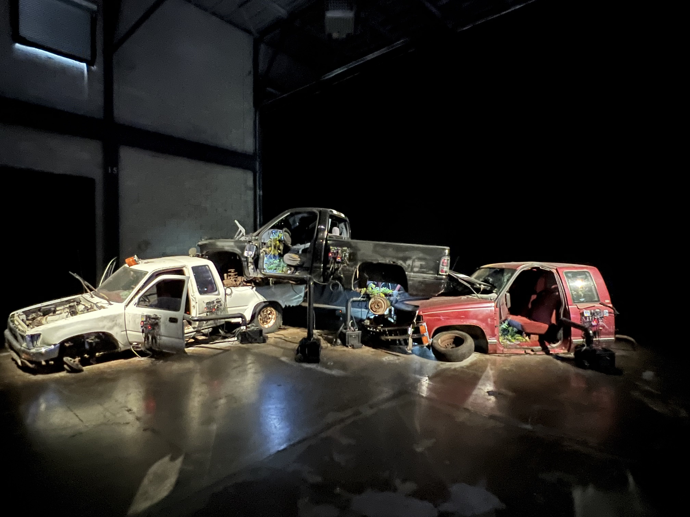
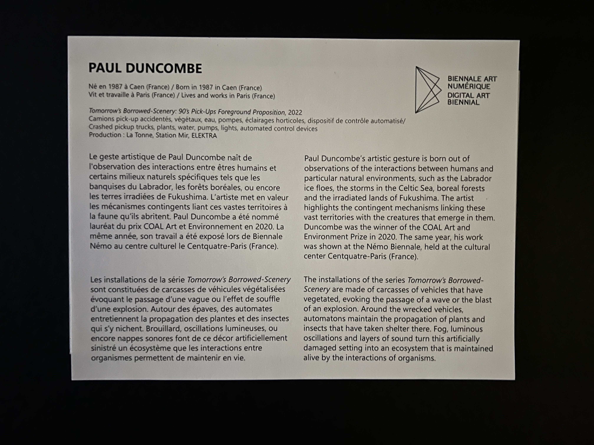
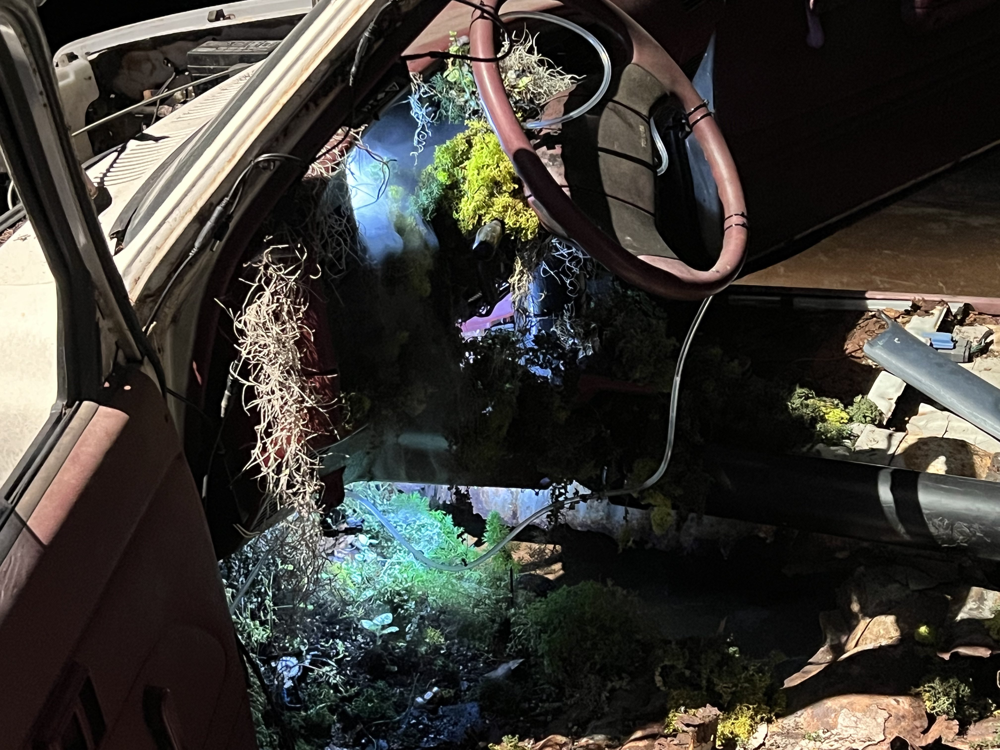
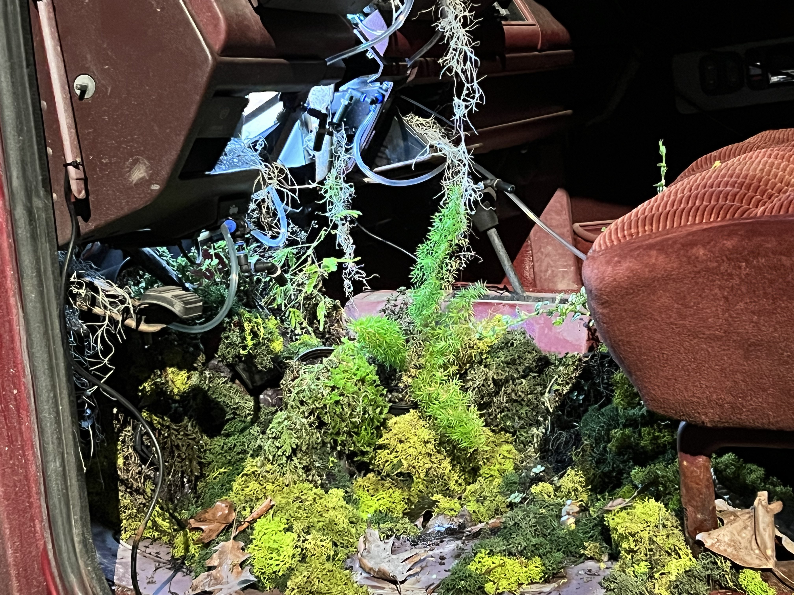
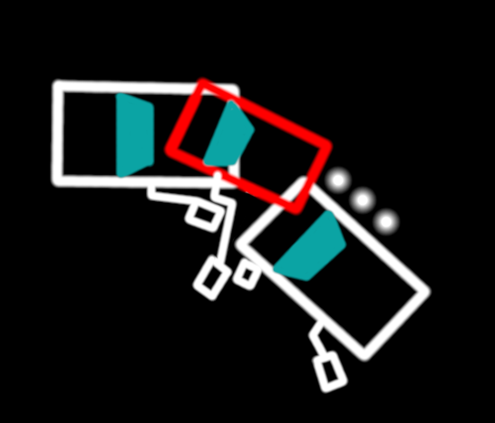
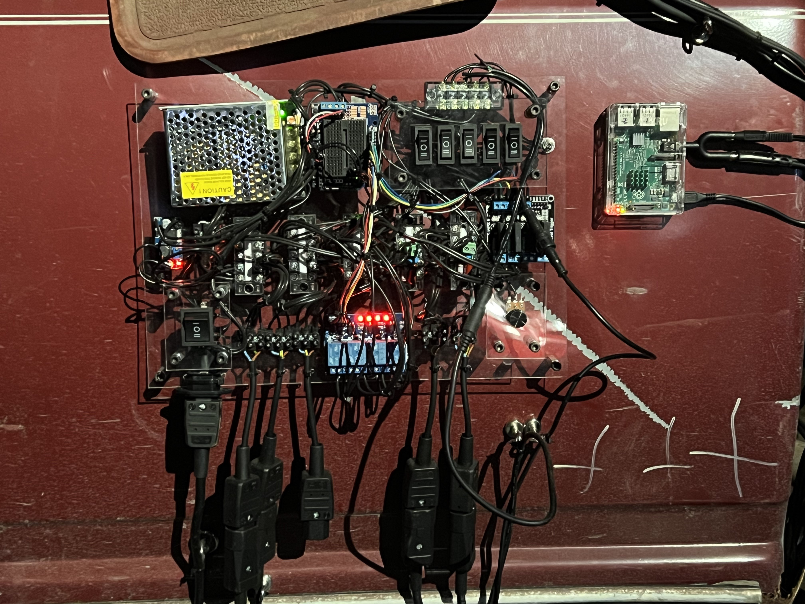
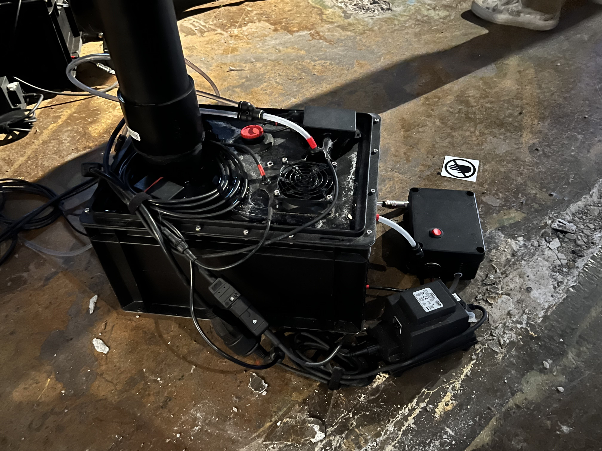
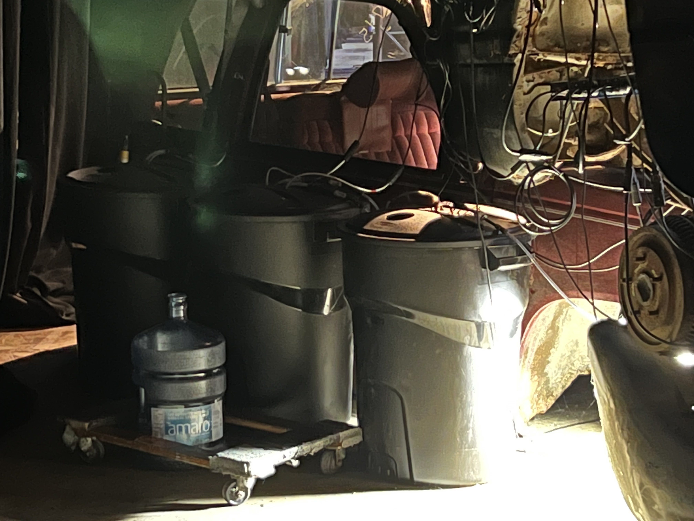

# Fiche de présentation de L'oeuvre "Tomorrow's Borrowed Scenery"

## Informations sur l'exposition

- Exposition: 6e biennale d'art numérique
- Lieu d'exposition: Arsenal d'art contemporain, 2020 rue william Montréal

</img>

- Type: Exposition temporaire
- Date de la visite: 3 février

## Informations sur l'oeuvre

-Titre de l'oeuvre: **Tomorrow's Borrowed Scenery**

</img>

- Nom de l'artiste: Paul Duncombe
- Année de réalisation: 2022
- Description de l'oeuvre: Tomorrow's Borrowed Scenery est une oeuvre multimédia qui consiste à faire pousser de la mousse sur trois vieux véhicules empilés. L'oeuvre fontionne en surveillant constamment les besoins des plantes, et si nécessaire va subvenir à ce besoin. Si les plantes ont besoin d'eau, une vapeur d'eau est distribuée via des tuyaux. Si les plantes ont besoin de lumière, une lampe est allumée. 

</img> </img> </img>

- Type d'installation: Contemplative
- Mise en espace: L'oeuvre est située au coin d'une pièce. Les voitures sont orientées de façon à ce qu'on voit les plantes du centre de la pièce. Elles ne sont pas collées au mur par contre, puisque il faut passer pas derrière pour accéder à certaines composantes importantes pendant la maintenance.

</img>

- Composantes et techniques: Chaque système de maintenance des plantes est géré par un microcontrôleur rasbpberry pi. Les microcontrôleurs actionnent des relais qui vont déclencher la lumière et les pompes pour la vapeur d'eau. L'eau pour les plantes est stockée à l'arrière des voitures dans de grosses poubelles noires.

</img> </img> </img>

- Éléments nécessaires à l'exposition: Des projecteurs qui éclairent les trois voitures, 4 microcontrôleurs rasbperry pi qui traitent les informations sur les plantes et 4 circuits de relais qui contrôlent les pompes et l'éclairage intérieur.

## Expérience vécue
Puisque les composants de l'oeuvre peuvent être fragiles, l'interacteur ne doit que contempler l'oeuvre.
Voir les plantes qui ont poussé au fil du temps dans ces voitures est quelque chose d'un peu hors du commun, puisque c'est ce qu'on verrait dans un monde post apocalyptique. C'est plutôt intéressant de voir que une tâche aussi simple à réaliser qu'est de s'occuper de plantes, ait besoin d'autant de circuiterie pour fonctionner.

## Aspects à ne pas retenir

Bien que le concept soit simple, il n'est pas très facile de comprendre le but de cette oeuvre. Un timelapse aurait pu être une bonne façon de montrer la progression des plantes au fil du temps, comme l'oeuvre des deux voitures par exemple.
