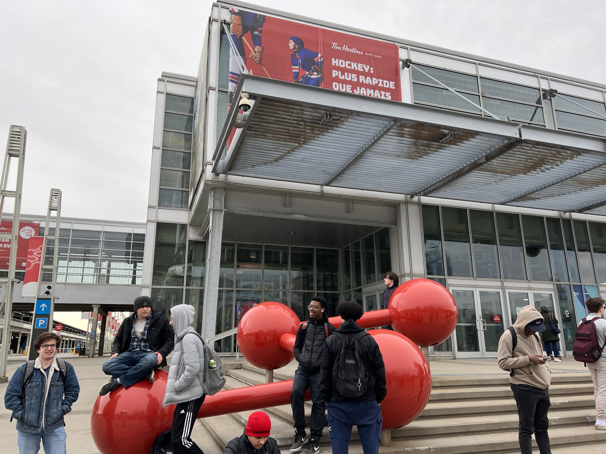
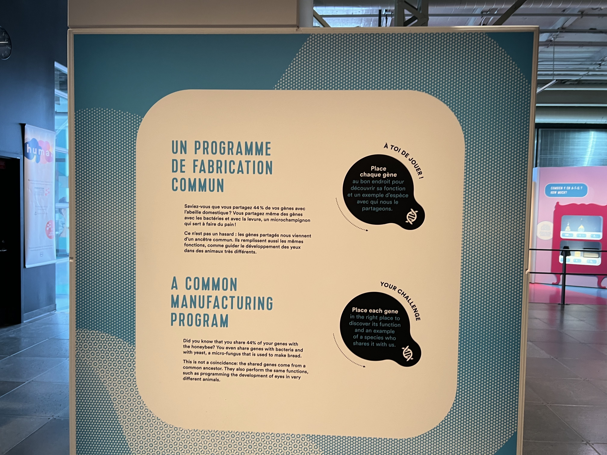
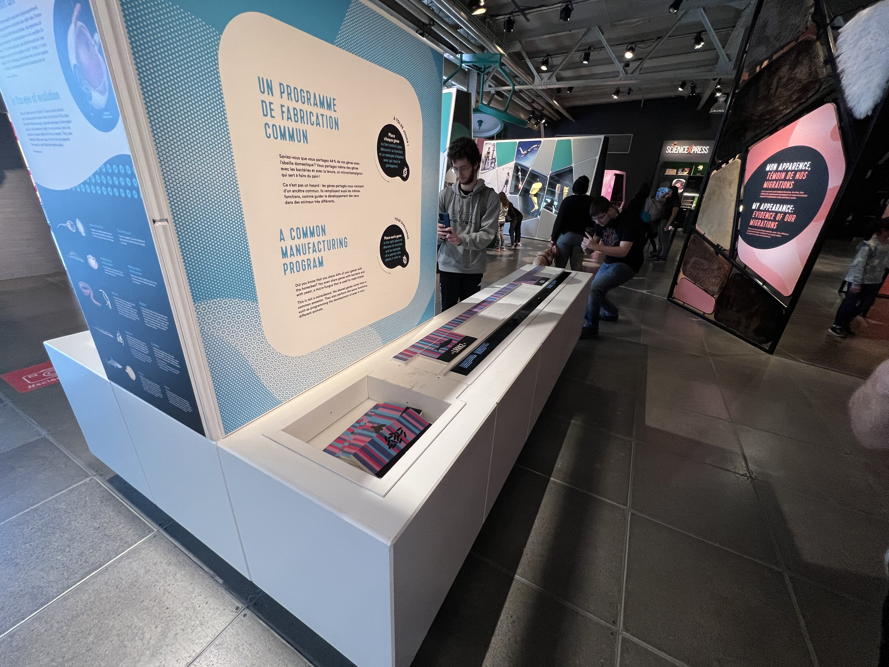
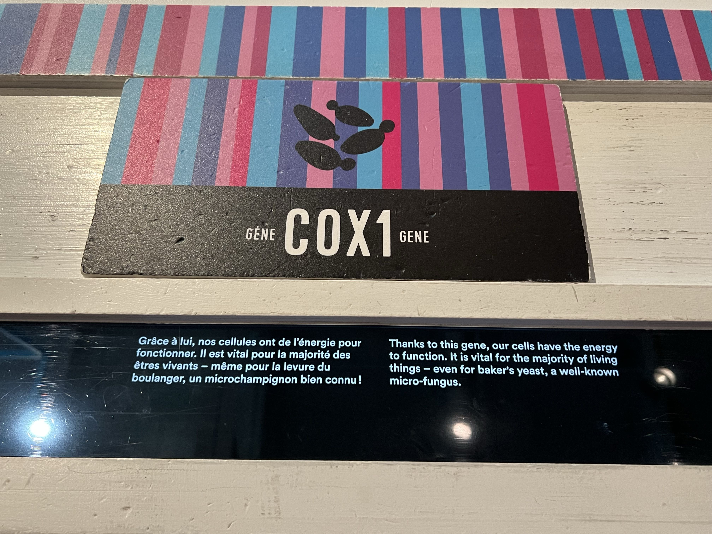
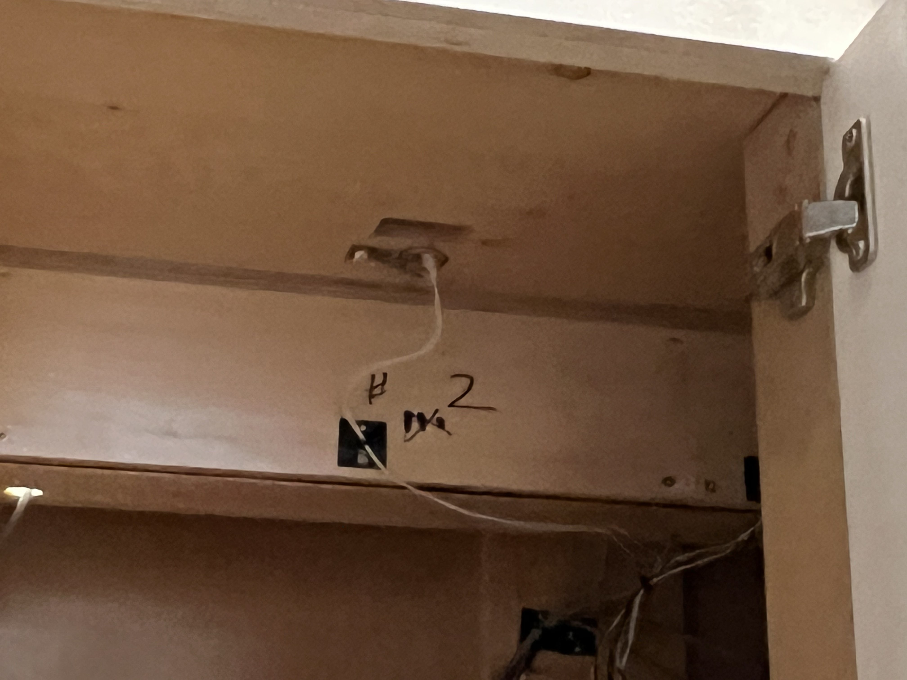
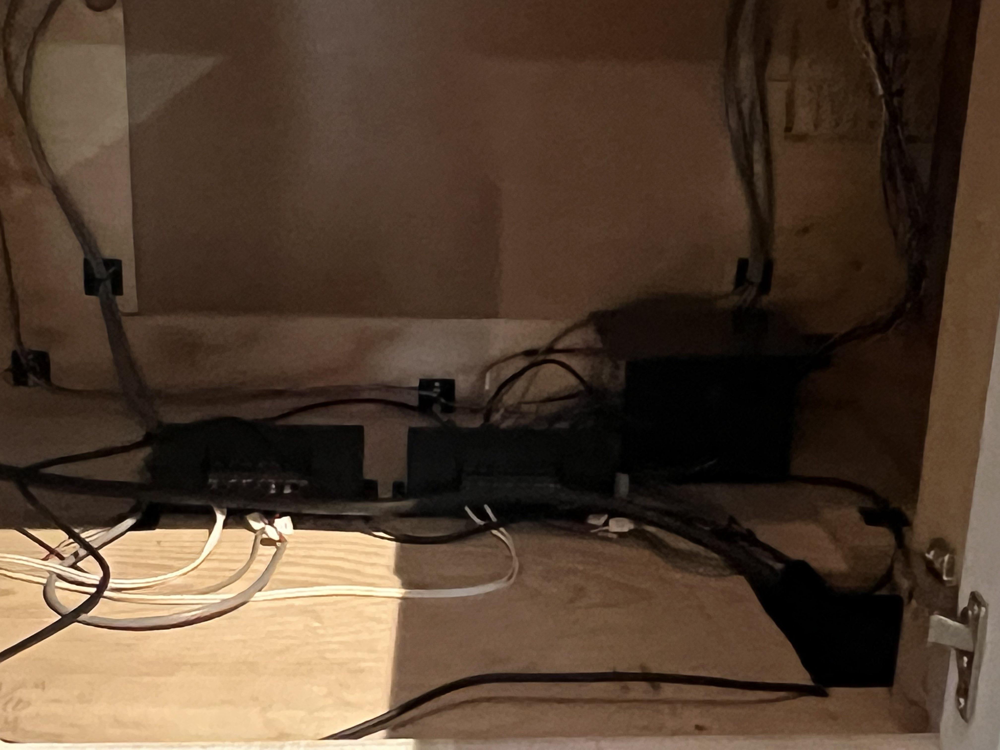

# Fiche de présentation du dispositif "Un programme de fabrication commun"

## Informations sur l'exposition

- Exposition: Humain
- Lieu d'exposition: Centre des sciences de Montréal, 2 Rue de la commune Ouest Montréal

</img>

- Type: Exposition Permanente
- Date de la visite: Mercredi 12 Avril 2023

## Informations sur le dispositif

- Titre du dispositif: Un programme de fabrication commun

</img> </img>

Description du dispositif: "Un programme de fabrication commun" est un dispositif multimédia à but éducatif. Ce dispositif permet d'apprendre (de façon très basique) d'apprendre comment les gènes fonctionnent. Afin d'atteindre ce but, l'interacteur doit placer plusieurs rectangles (voir ci-dessous) afin d'aligner les barres de couleur de celui-ci avec les barres de couleur de la structure. Si l'interacteur réussit à le faire, un petit texte informatif s'allume pour indiquer que le rectangle est à la bonne place.

</img>

- Type d'installation: Interactive
- Mise en espace: Le dispositif est installé parmi plusieurs autres dispositifs similaires. Des projecteurs sont installés au plafond afin d'éclairer uniformément le dispositif.

[//]: # (Insérer Croquis de la mise en espace)

Composantes et techniques: Il y a une puce RFID (Radio Frequency Identification) à l'intérieur de chaque rectangle. Grâce à ces puces, le dispositif est capable de déterminer si le bon rectangle est à la bonne place. Si c'est le cas, le texte associé au rectangle s'allume. Chaque texte qui s'allume est connecté à un contrôleur XLR (External line return) qui permet de facilement contrôler les éclairages, sur demande d'un microcontrôleur tel qu'un Arduino.

</img> </img>

## Expérience vécue
