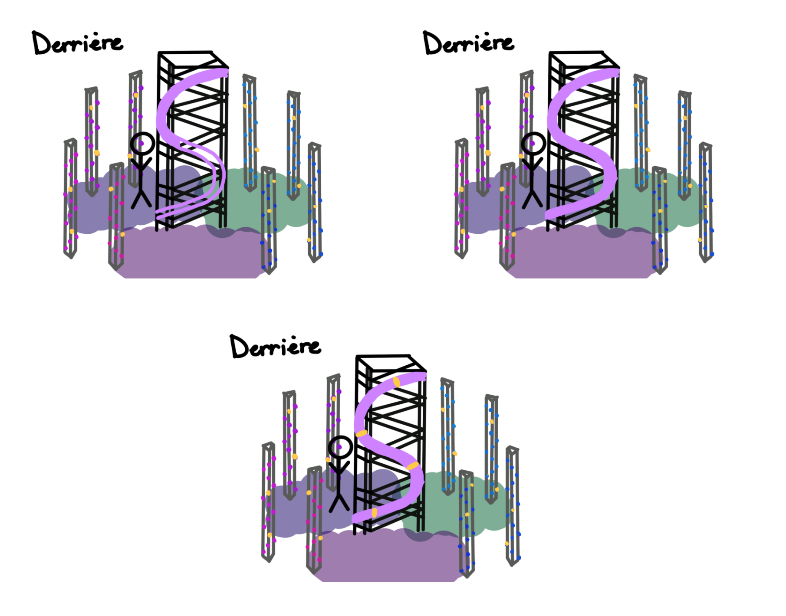
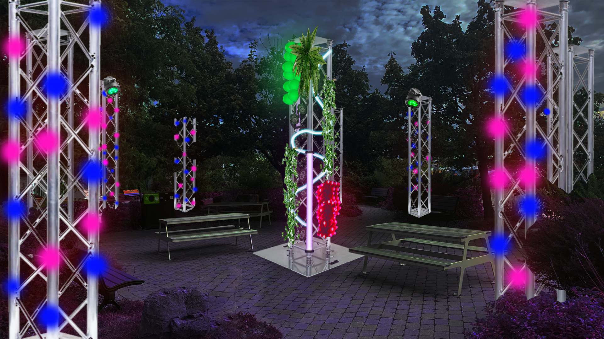
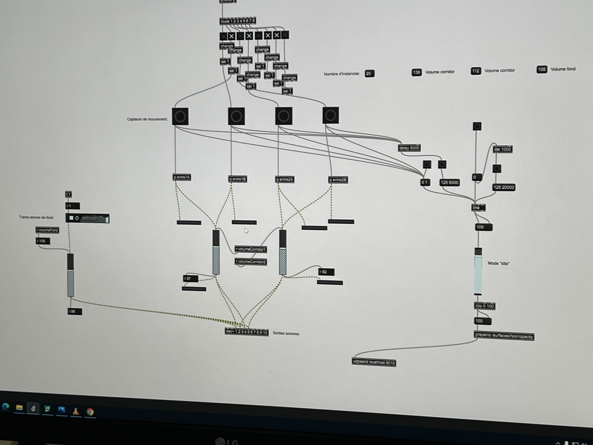

# EDRIA

Oeuvre réalisée par Elwin Durand, Loic Delorme, Dominic Roberts, Gabriel Leblanc, Meryem Berbiche et Jean-Christophe Zephyr

Oeuvre réalisée en 2023

Lien: https://tim-montmorency.com/2023/projets/EDRIA/docs/web/index.html

## Installation en cours

</img>

## Schéma de l'installation

</img>

## Cours nécessaires

Programamtion: Afin de programmer l'interactivité (capteurs + éclairage)

Installation Multimédia: Afin de créer la structure de l'oeuvre

Objets interactifs: Afin d'ajouter des objets qui créeront l'interactivité

## Technique ou composante utilisée

Max 8: Ce logiciel est utilisé afin de faire fonctionner l'audio et l'éclairage en tandem

</img>
