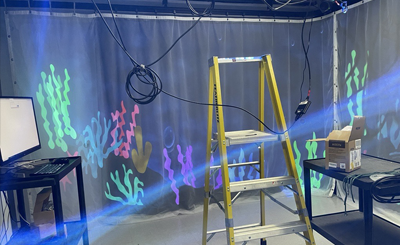
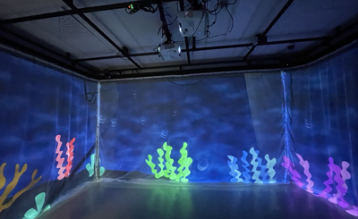

# Echomarine

Oeuvre réalisée par Florence Lapierre, Natacha Abdallah, Tracy Gua, Maria Laura Coronel

Oeuvre réalisée en 2023

Lien: https://tim-montmorency.com/2023/projets/Echomarine/docs/web/index.html

## Installation en cours

</img> </img>

## Schéma de l'installation

[Schéma manquant sur la page du projet]

## Cours nécessaires

Animation 2D: Afin de créer les images qui composent chaque projection

Programmation web: Afin de faire fonctionner la page web qui contrôle les projections

Installation multimédia: Afin de correctement monter les projecteurs et composants

## Technique ou composante utilisée

MadMapper: Madmapper est utilisé afin de monter les murs de projections correctement. MadMapper est un logiciel utilisé afin de préparer une surface de projection qui n'est pas conventionnelle comme un tableau blanc, mais plutôt sur des surfaces telles des maisons ou murs arrondis.

</img>
