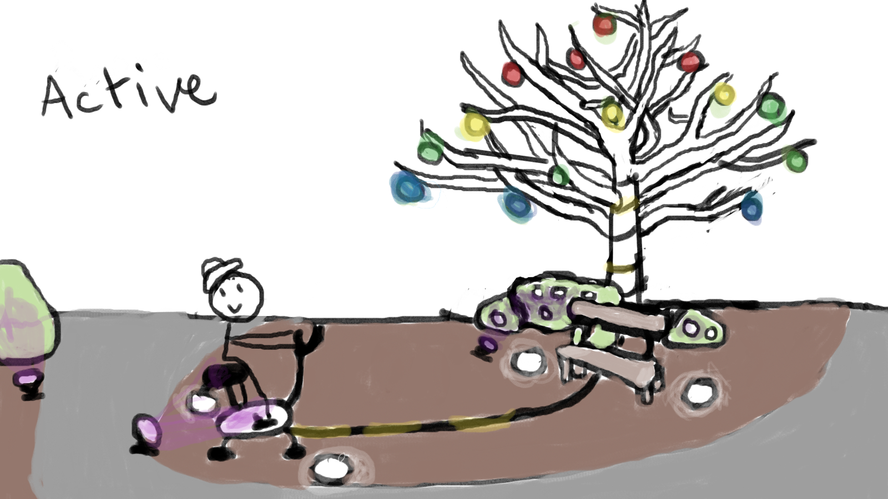
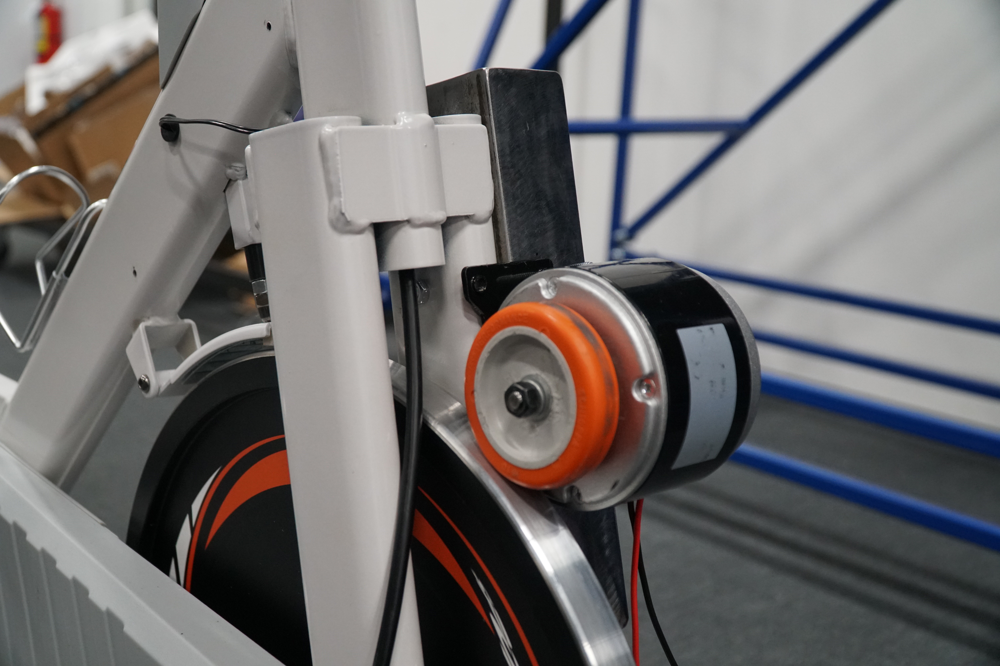

# Luma Sol

Oeuvre réalisée par Éloïse Gagné, Skayla Stimphil, Michaël Simard et Pénélope Morrisson.

Oeuvre réalisée en 2023

Lien: https://tim-montmorency.com/2023/projets/LumaSol/docs/web/index.html

## Installation en cours

</img>

[Images tirées du site du projet]

## Schéma de l'installation

</img>

## Cours nécessaires

Programmation: Afin de détecter quand quelqu'un pédale pour déclencher les effets de lumière

Installation Multimédia: Afin de crées une installatyion durable extérieure

Traitement vidéo: Afin de faire fonctionner les sons et couleurs de l'installation

## Technique ou composante utilisée

Moteur électrique comme dynamo: Un moteur électrique a été raccordé à la roue d'un vélo stationnaire afin de créer de l'électricité pour activer l'animation et recharger les téléphones branchés sur les prises usb.

</img>
