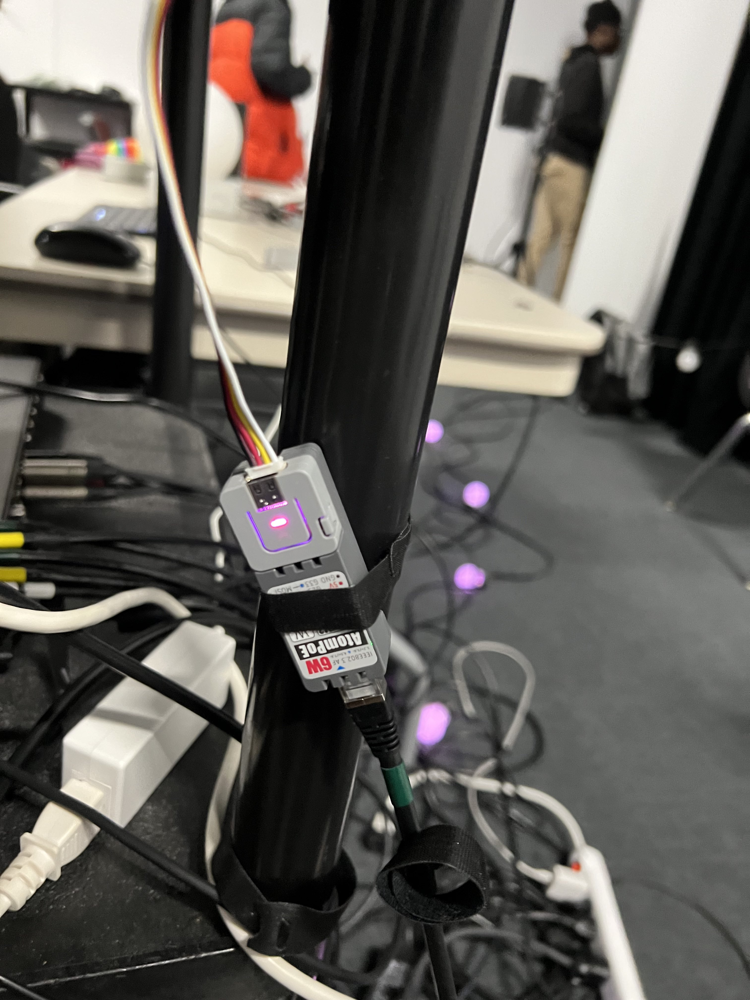

# Nexum / Boucler la boucle

Oeuvre réalisée par Sébastien Reilly, Sabrina Laforest, Alexandre Daniel et Maxime Des Lauriers

Oeuvre Réalisée en 2023

Lien: https://tim-montmorency.com/2023/projets/Boucler-la-boucle/docs/web/index.html

Lien entre l'oeuvre et le thème Mycélium: Nexum est un mot latin qui signifie "connexion". Puisque les champignons sont connectés entre eux et avec d'autres champignons, 

## Installation en cours

Le projet est pour être installé devant le collège, dans le petit sentier en face de la salle André Mathieu

</img>

[Image tirée du site du projet Nexum]

## Schéma de l'installation

</img>

[Image tirée du site du projet Nexum]

## Cours nécessaires

Trois cours nécessaires à la conception de cette oeuvre sont:

- Programmation: Afin d'être capable de programmer les microcontrôleurs

- Traitement vidéo: Afin d'ëtre capable de monter un projet sur Max 8

- Conception Sonore interactive: Pour être capable de créer des sons et musique

## Technique ou composante utilisée

Plusieurs microcontrôleurs Arduino son utilisés pour contrôler l'animation de l'éclairage. Un microcontrôleur n'est pas exactement un ordinateur mais plutôt un contrôleur. Il fonctionne en créant du code pour celui ci via Arduino IDE. On utilise les plusieurs inputs et outputs (au choix) pour envoyer et recevoir toutes sortes de signaux digitaux.

</img>
