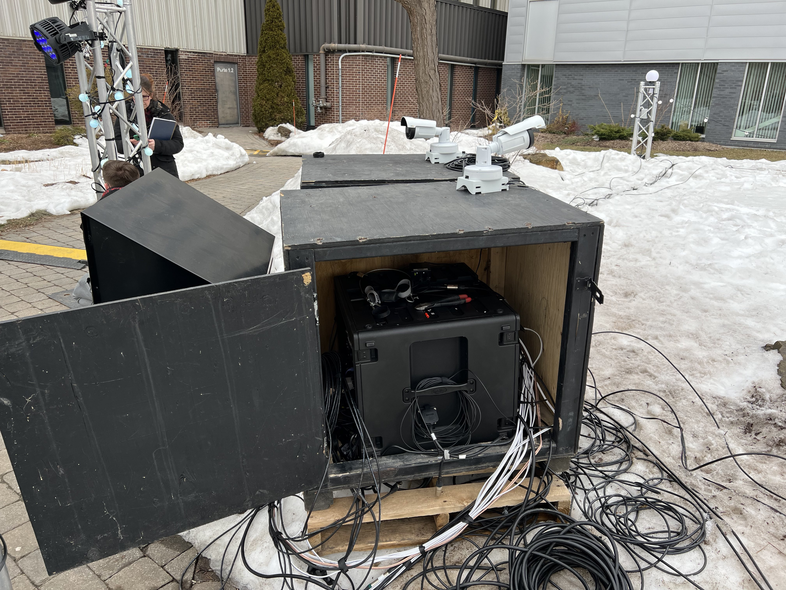

# EDRIA

Lien vers la page du projet: https://tim-montmorency.com/2023/projets/EDRIA/docs/web/index.html

- Lieu de l'exposition: Devant le collège en face du métro montmorency
- Type d'exposition: Temporaire
- Date de la visite: 17 mars

## Informations sur l'oeuvre

-Titre de l'oeuvre: EDRIA

-Oeuvre réalisée par: Elwin Durand, Loic Delorme, Dominic Roberts, Gabriel Leblanc, Meryem Berbiche et Jean-Christophe Zephyr

-Année de réalisation: 2023

</img>

-Description de l'oeuvre: EDRIA est un ensemble de structures recouverts de plantes, lumière et haut parleurs qui réagissent quand une personne s'en approche. La structure centrale possède plusieurs capteurs, qui déclenchent des animations quand des personnes se retrouvent autour de celle-ci. Il y a quatre capteurs sur cette structure et pour chaque capteur d'actionné, une animation joue. Une animation spéciale va également jouer quand tous les capteurs sont actionnés en même temps.

Type d'installation: Interactive

-Mise en espace: L'oeuvre est située à l'extérieur à un endroit public où les gens peuvent circuler. Les plusieurs structures sont placées uniformément dans cet espace.

</img>

[Image tirée de la page du projet]

-Composantes et techniques: Les structures possèdent des haut parleurs afin de diffuser la musique et les effets sonores. Il y a également des cache-fils sur le sol afin d'éviter de trébucher sur les fils.  L'appareil qui contrôle l'oeuvre est placée dans une boîte noire. La structure du centre possède 4 capteurs qui déterminent si quelqu'un est présent. Des lumières sont également installées sur les structures afin d'éclairer l'environnement.

</img> </img> </img> </img> </img> </img>

-Éléments nécessaires à l'exposition: Cache-fils, Rallonges électriques, Boitiers de protection contre les intempéries, Structure en bois pour protéger le système de contrôle, caméras de sécurité.

## Expérience Vécue

Le mélange de sons et de lumière était très agréable. C'était plutôt amusant de se placer en face de la structure principale afin de déclencher les animations. C'était aussi plaisant d'avoir un entroit où s'asseoir grâce à la table qui s'y trouve.

## Éléments pertinents

Le placement des structures permet de diffuser l'éclairage sur tout son environnement de façon efficace, de même que le placement des haut parleurs permet de bien diffuser le son dans son environnement.

## Aspects à ne pas retenir ou faits autrement

Il n'est pas très intuitif de se placer devant le pilier central et encore moins de placer quatre personnes devant les quatre capteurs en même temps. Cela aurait peut-être pris un au moins moyen de mettre en évidence qu'on doit se placer devant les capteurs.

## Références

Site consulté: https://tim-montmorency.com/2023/projets/EDRIA/docs/web/index.html
