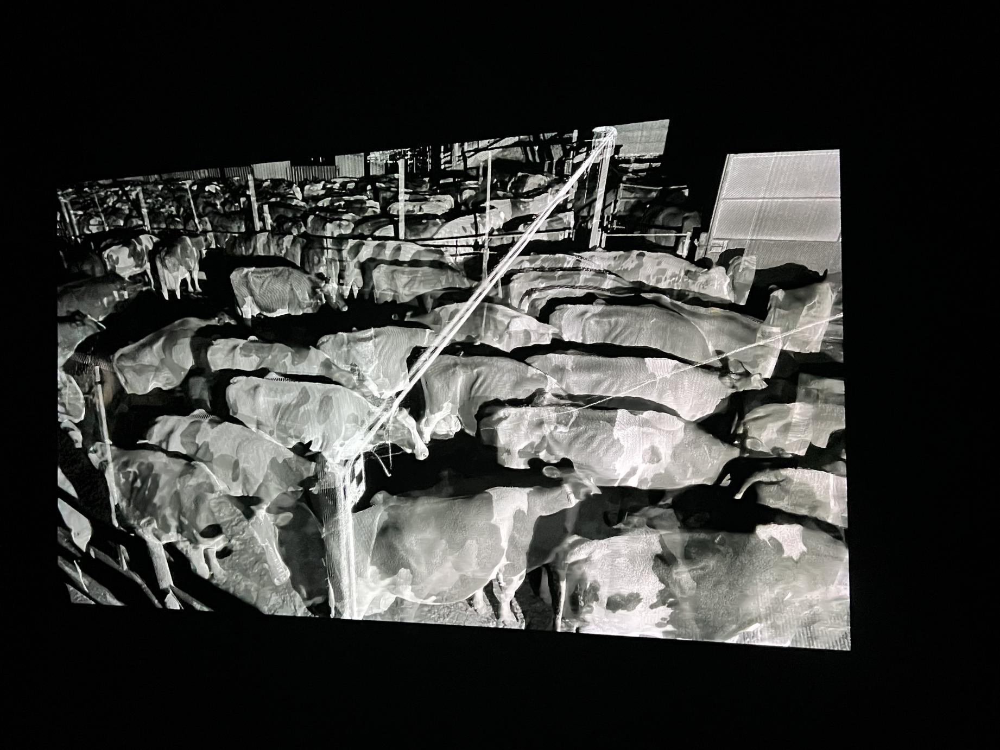
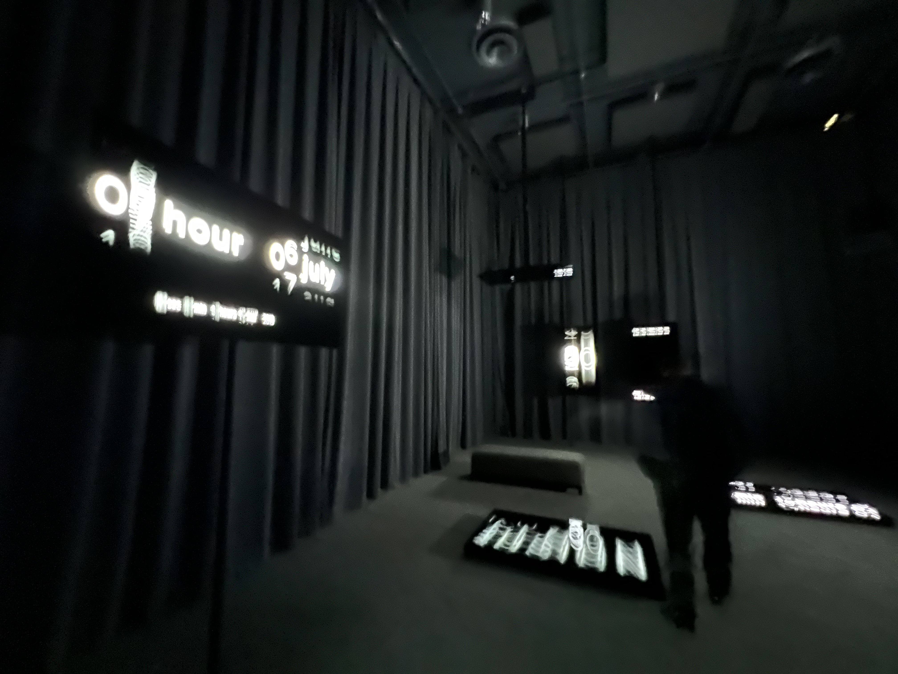
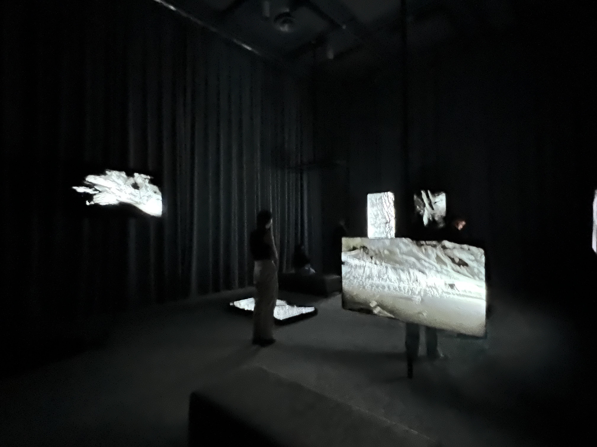

# Framerate: Pulse of the Earth

- Titre: Framerate: Pulse of the Earth

</img>

- L'oeuvre a été créée par: Matt Shaw, William Trossell, Meriko Borogove, Anetta Jones, Pascal Wyse, Tom Brooks, Kunal Lodhia, Grey Grierson, Brad Damms, Paul Macro Demelza Kingston, Theo Tan, Dorka Makai, Jacques Pillet, Nicky Ovidiu Baiculescu, Soma Sato, Emilia Clark, Manuela Mesrie, Max Celar et James White.

- L'équipe est connue sous le nom de ScanLAB

- Année de réalisation: 2022

- Exposition: Chaos et mémoires au Centre PHI

- Type d'exposition: temporaire

- Date de la visite: 1er Avril 2023

- Description de l'oeuvre: L'oeuvre est une compilation d'environ 730 scans de multiples lieux qui ont été pris pendant deux ans. Les images défilent à toute vitesse et forment une vidéo qui montre comment ces lieux changent en deux ans.

</img> </img> 

- Type d'exposition: Conteplative

- Mise en espace: l'oeuvre est visionnée dans une salle très sombre avec 8 écrans placés un peu partout dans la pièce. Deux écrans sont sur le plancher et un écran est accroché au plafond. Le reste est accroché au mur. Plusieurs haut parleurs sont placés dans la pièce afin de diffuser de la musique pour aggrémenter l'oeuvre. Il semble également avoir un appareil derrière chaque écran qui doit probablement recevoir et afficher les vidéos.

</img> </img> </img> </img> 

- Expérience vécue: L'oeuvre était plutôt impressionnante, sachant tout les efforts derrière chacun des vidéos. Puisque chaque écran affichait un angle différent, il était difficile de s'ennuyer. Des bancs étaient également à notre disposition afin de pouvoir se mettre confortable. Il était un peu étrange cependant que la pièce devienne complètement noire entre chacun des vidéos. Aussi, l'oeuvre mettait beaucoup de temps à démarrer. D'ailleurs, un employé devait la démarrer en avance à cause de cela.

